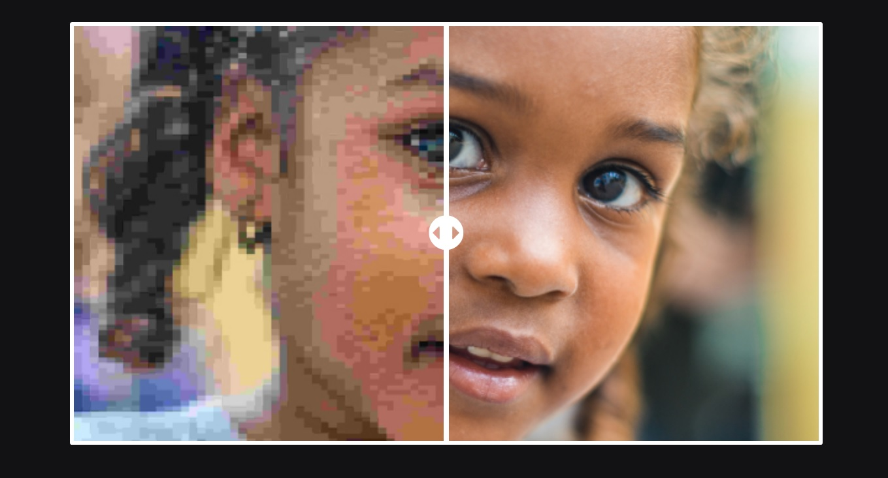

<h1 align="center"> Interface Antes de Depois da IA </h1>

#boraCodar são desafios semanais, promovido pela Rocketseat para ensino de tecnologias WEB.  

  <a href="#-tecnologias">Tecnologias</a>&nbsp;&nbsp;&nbsp;|&nbsp;&nbsp;&nbsp;
  <a href="#-layout">Layout</a>&nbsp;&nbsp;&nbsp;&nbsp;&nbsp;&nbsp;

 

  

## 🚀 Tecnologias

Esse projeto foi desenvolvido com as seguintes tecnologias:

- HTML e CSS
- Git e Github
- JavaScript
- Figma

## 🔖 Layout

Você pode visualizar o layout do projeto através [DESSE LINK](https://www.figma.com/community/file/1263495196524106760). É necessário ter conta no [Figma](https://figma.com) para acessá-lo.

---

Feito com ♥ by Renato de Paula pela Rocketseat  [Participe da nossa comunidade!](https://discord.gg/rocketseat)